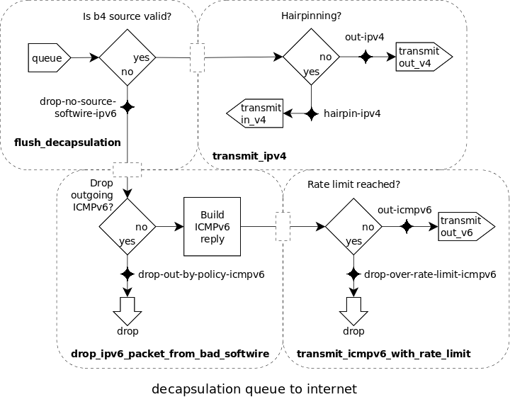
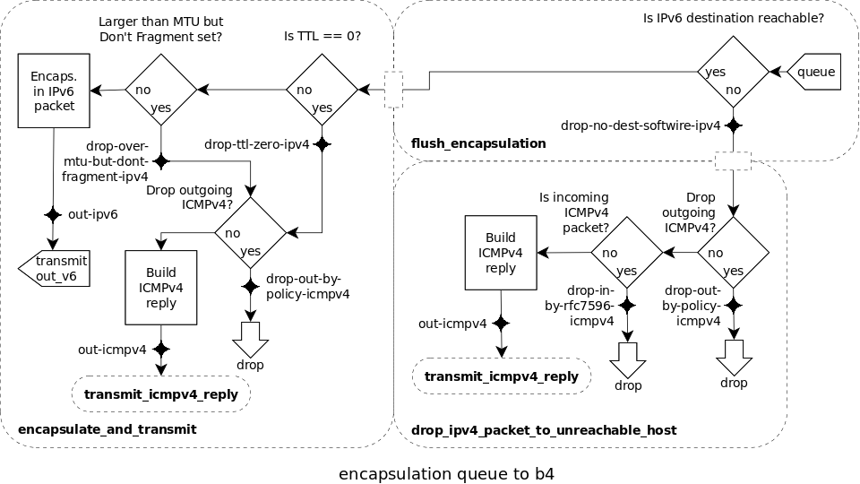

# Counters

<<<<<<< HEAD
The number of packets and bytes handled in various points of the execution flow
are recorded in counters, updated in real time.

The counters are accessible as files in the runtime area of the Snabb process,
typically under `/var/run/snabb/[PID]/app/lwaftr/counters/`.

Most counters are represented by two files, ending with the `bytes` and
`packets` suffixes.

## Execution flow

This is the lwAftr's overall execution flow:
=======
In order to better understand the flow of packets through the lwAftr app at
runtime, a number of counters are embedded in the code. They record the
number of packets and bytes handled at various points of the execution flow,
shown in the diagrams below.

The counters' values can be accessed by means of the `snabb top` subcommand.

## Execution flow

Here is the lwAftr's overall execution flow:
>>>>>>> 09ac70d... Add docs for the counters

Packets coming from the b4 on users' premises are decapsulated, handled, then
<<<<<<< HEAD
sent to the Internet or dropped, as appropriate.

On the other side, packets coming from the Internet are handled, possibly
dropped, or encapsulated and sent to users' b4.

Each direction is in turn broken in two by two queues, in order to reduce the
cost lookups in the binding table. The four resulting macro blocks are
described below, in clockwise order.
=======
sent to the Internet or dropped, as appropriate. On the other side, packets
coming from the Internet are handled, possibly dropped, or encapsulated and
sent to users' b4.

Some packets coming from a b4 may be destined to another b4 handled by the same
lwAftr instance: in that case, as an optimization, they are short-circuited
("hairpinned") to their destination internally, so that they are not uselessly
routed forward and back.

Each direction is broken in two by lookup queues, in order to reduce the cost
of lookups in the binding table. The four resulting macro blocks are detailed
below, in clockwise order.
>>>>>>> 09ac70d... Add docs for the counters

For each macro block, the place of all counters in the execution flow is first
shown graphically, then each counter is described in detail. Several counters
appear in more than one place, and the dashed blocks designate functions in
the Lua code.

### b4 to decapsulation queue

Counters:

<<<<<<< HEAD
- **drop-misplaced-ipv6**: non-IPv6 packets incoming on the IPv6 link
=======
- **drop-misplaced-not-ipv6**: non-IPv6 packets incoming on the IPv6 link
>>>>>>> 09ac70d... Add docs for the counters
- **in-ipv6**: all valid incoming IPv6 packets
- **drop-unknown-protocol-ipv6**: packets with an unknown IPv6 protocol
- **drop-in-by-policy-icmpv6**: incoming ICMPv6 packets dropped because of
  current policy
<<<<<<< HEAD
- **drop-too-big-type-but-not-code-icmpv6**: the packets' ICMPv6 type is
  "Packet too big", but the ICMPv6 code is not, as it should
- **out-icmpv4**: internally generated ICMPv4 error packets
- **drop-over-time-but-not-hop-limit-icmpv6**: the packets' time limit is
  exceeded, but the hop limit is not
=======
- **out-icmpv4**: internally generated ICMPv4 error packets
- **out-ipv4**: all valid outgoing IPv4 packets
- **drop-too-big-type-but-not-code-icmpv6**: the packet's ICMP type was
  "Packet too big", but its ICMP code was not an acceptable one for this type
- **drop-over-time-but-not-hop-limit-icmpv6**: the packet's time limit was
  exceeded, but the hop limit was not
>>>>>>> 09ac70d... Add docs for the counters
- **drop-unknown-protocol-icmpv6**: packets with an unknown ICMPv6 protocol

### decapsulation queue to Internet

Counters:

- **drop-no-source-softwire-ipv6**: no matching source softwire in the binding
<<<<<<< HEAD
  table
- **hairpin-ipv4**: IPv4 packets going to a known b4 (hairpinned)
- **out-ipv4**: all valid outgoing IPv4 packets
=======
  table; incremented whether or not the reason was RFC7596
- **out-ipv4**: all valid outgoing IPv4 packets
- **hairpin-ipv4**: IPv4 packets going to a known b4 (hairpinned)
>>>>>>> 09ac70d... Add docs for the counters
- **drop-out-by-policy-icmpv6**: internally generated ICMPv6 error packets
  dropped because of current policy
- **drop-over-rate-limit-icmpv6**: packets dropped because the outgoing ICMPv6
  rate limit was reached
- **out-icmpv6**: internally generated ICMPv6 error packets

### Internet to encapsulation queue

Counters:

<<<<<<< HEAD
- **drop-misplaced-ipv4**: non-IPv4 packets incoming on the IPv4 link
- **in-ipv4**: all valid incoming IPv4 packets
- **drop-in-by-policy-icmpv4**: incoming ICMPv4 packets dropped because of
  current policy
- **drop-bad-checksum-icmpv4**: ICMPv4 packets dropped because of a bad
  checksum
=======
- **drop-in-by-policy-icmpv4**: incoming ICMPv4 packets dropped because of
  current policy
- **in-ipv4**: all valid incoming IPv4 packets
- **drop-misplaced-not-ipv4**: non-IPv4 packets incoming on the IPv4 link
- **drop-bad-checksum-icmpv4**: ICMPv4 packets dropped because of a bad
  checksum
- **drop-all-ipv4-iface**, **drop-all-ipv6-iface**: all dropped packets and
  bytes that came in over the IPv4/6 interfaces, whether or not they're
  actually IPv4/6 (they only include data about packets that go in/out over the
  wires, excluding internally generated ICMP packets)
>>>>>>> 09ac70d... Add docs for the counters

### Encapsulation queue to b4

Counters:

<<<<<<< HEAD
- **drop-no-dest-softwire-ipv4**: no matching destination softwire in the
  binding table
- **drop-out-by-policy-icmpv4**: internally generated ICMPv4 error packets
  dropped because of current policy
- **drop-in-by-rfc7596-icmpv4**: incoming ICMPv4 packets with no destination
  (RFC 7596 section 8.1)
- **out-icmpv4**: internally generated ICMPv4 error packets (same as above)
- **drop-ttl-zero-ipv4**: IPv4 packets dropped because their TTL is zero
- **drop-over-mtu-but-dont-fragment-ipv4**: IPv4 packets whose size exceeds the
  MTU, but the DF (Don't Fragment) flag is set
- **out-ipv6**: all valid outgoing IPv6 packets

## Aggregation counters

Several additional counters aggregate the value of a number of specific ones:

- **drop-all-ipv4**: all dropped incoming IPv4 packets (not including the
  internally generated ICMPv4 error ones)
- **drop-all-ipv6**: all dropped incoming IPv6 packets (not including the
  internally generated ICMPv6 error ones)
=======
- **out-ipv6**: all valid outgoing IPv6 packets
- **drop-over-mtu-but-dont-fragment-ipv4**: IPv4 packets whose size exceeded
   the MTU, but the DF (Don't Fragment) flag was set
- **drop-ttl-zero-ipv4**: IPv4 packets dropped because their TTL was zero
- **drop-out-by-policy-icmpv4**: internally generated ICMPv4 error packets
  dropped because of current policy
- **drop-no-dest-softwire-ipv4**: no matching destination softwire in the
  binding table; incremented whether or not the reason was RFC7596
- **drop-in-by-rfc7596-icmpv4**: incoming ICMPv4 packets with no destination
  (RFC 7596 section 8.1)

## Notes

The internally generated ICMPv4 error packets that are then dropped because
of policy are not recorded as dropped: only incoming ICMP packets are.

Implementation detail: rhe counters can be accessed as files in the runtime
area of the Snabb process, typically under
`/var/run/snabb/[PID]/app/lwaftr/counters/`. Most of them are represented by
two files, ending with the `bytes` and `packets` suffixes.
>>>>>>> 09ac70d... Add docs for the counters
